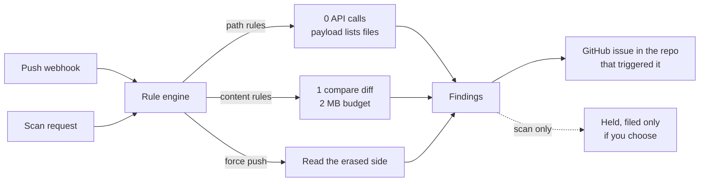
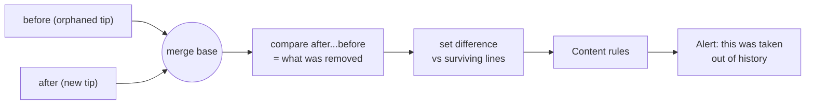
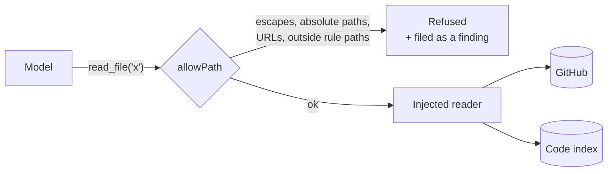
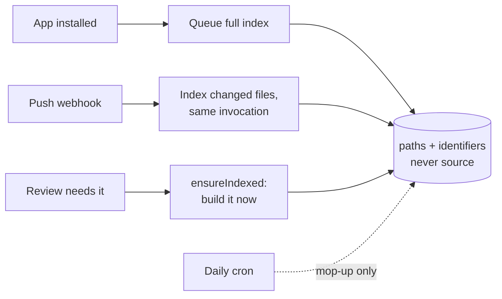

# Pushguard

Org-wide push monitoring for GitHub. One App install watches every repository,
evaluates each push against your rules, and opens a ticket naming the pushing
account: force pushes, install hooks, workflow tampering, obfuscated payloads,
or any file you decide to watch.

Built for the attack where a compromised teammate force-pushes code that runs on
everyone else's machine at the next pull.

[`RUNTIME.md`](RUNTIME.md) is the visual map: what runs when, and how many API
calls each path costs. [`AI_REVIEW.md`](AI_REVIEW.md) covers the AI architecture.
[`DESIGN.md`](DESIGN.md) holds older reasoning and is partly out of date.

## How it works



Watching is the product; scanning is how you see what it finds before installing
anything.

- **Zero configuration.** Installing seeds nothing — the 78-rule catalog ships
  with the code, so detection is live on the first push with no database write.
- **Rules belong to your account**, not one org. Narrow an individual rule with
  its own `repos` patterns.
- **Alerts are GitHub issues**, filed in the repository that triggered them. A
  **public** repo gets the alert but not the evidence: rule, severity, files and
  commits are named, matched lines withheld with a pointer to the dashboard.
  Quoting them would turn an alert about a leaked secret into a search-indexed
  copy of it. A private repo quotes in full.
- **No cache, no TTL.** Stored GitHub data is a projection maintained by
  webhooks. The one exception is deliberate: which repositories a *user* may read
  is asked of GitHub on every request, because nothing tells us when that changes.
- Multi-tenant: one deployment, any number of organizations.

### Force-push forensics

A force push is the only push that removes evidence instead of adding it. Once it
lands the old tip is unreachable — `git clone` gets the survivors, and so does
every scanner that reads a checkout.



The order is the whole trick: **new tip as base, orphaned tip as head**. Reversed,
it returns the surviving side — plausible, and it detects nothing. The set
difference is what separates "removed from history" from "rebased", which
developers do all day.

Time-sensitive: `before` is unreachable the moment the push lands, so this runs
on the webhook, never from a cron picking it up later.

## Scanning

Reads what is already committed instead of waiting for a push.

- **GitHub decides what you may scan.** The picker is filled with *your* token;
  the same check runs again server-side when the scan is queued. Naming a
  repository in the request body gets a 403 if GitHub does not list it for you.
  An installation token is never used to decide access — it sees more than any
  one member may read.
- Every result records what it read: branch, commit count, SHA range, compare
  link. "Nothing flagged" is distinguishable from "never looked at".
- **Nothing is filed on GitHub.** Filing is a separate, deliberate action, and
  access is re-checked at that moment.
- **A scan cannot answer every rule.** Rules keyed on the push event (`forced`,
  branch created, `hour_utc`) are dropped — a snapshot has nothing to answer them
  with. That is the honest limit of scanning, and the reason to install.
- Limits: 25 scans/day, 20 repos each, one at a time per account (enforced by a
  unique partial index, not a read-then-write).

## Rules

78 rules in `lib/rules/catalog/`, 16 packs. A file, not a table. The database
holds only what you **changed** — an override, or a rule you wrote.

A pack is a grouping label, not a scope. Nobody declares a repository is C++;
ecosystem rules are scoped by their own `paths`.

Rules are checked for catastrophic backtracking (`recheck`) **when written**, not
when read: a pattern like `(\w+\s?)+=` lets an attacker hang the scanner on
demand, and a detector that goes quiet is worth more to them than the rule is to
you.

See [`public/rules.example.yaml`](public/rules.example.yaml) for the schema by
example — also served at `/rules.example.yaml` on a running instance.

## AI rules

A rule a model answers. It fires on its own `paths`, never as an escalation on a
regex hit — that would mean it could only ever find what the regex already found.

| | Pattern rule | AI rule |
|---|---|---|
| Cost | free, every push | metered |
| Answer | deterministic | judgement |
| Finds | what you predicted | what you did not |

`scope` picks which pipeline runs:

```mermaid
flowchart TD
  rule{scope}
  rule -->|changed| bulk["Bulk load changed files<br/>matching paths"]
  bulk --> graph["Two-stage graph<br/>cheap triage, then deep"]
  graph --> verdict1[Findings]

  rule -->|repository| sess[Queue a review session]
  sess --> orient["Diff stats + hunks<br/>+ dependency advisories"]
  orient --> agent[Agent navigates with tools]
  agent --> readf[read_file]
  agent --> findr[find_references]
  readf --> agent
  findr --> agent
  agent --> verdict2[Findings]
```

**`changed`** runs inline on the push. Bulk-loads the files the rule's `paths`
match, sends them through a cheap triage model, and escalates only what triage
flags. Caps: 10 rules/push, 10 files/rule, 40k chars/file, 120k/rule.

**`repository`** runs as a background session. The agent gets the diff as
orientation, then navigates the tree by reading files and following names.

### The model never holds a credential

Every file under review is attacker-controlled — that is the premise. So the
model gets *tools*, not a token. It emits a path; our code decides whether it
gets one.



An injected instruction can only produce a *rejected argument*. Refusals are
themselves reported as `ai-rule-left-its-scope` — that is where injection
surfaces. The tool layer imports neither the database nor Octokit; guards in the
test suite keep it that way.

### The code index

`find_references` answers from our own index, costing zero GitHub calls. GitHub
has no call-graph API, and code search is 10 req/min, default-branch only, and
lags — none of which a review can build on.



Nothing waits on the schedule — Vercel Hobby allows one cron run a day. Blob-SHA
diffing means unchanged files are never re-read: a one-file push costs one batch.

Reads use one tree call (which carries sizes, so oversized files are skipped
without being fetched) plus GraphQL batches of ~40 files. **200 files = 6 calls,
not 200.**

It answers *mentions*, not call sites. It narrows 3,000 files to 9 for the model
to read properly. It is not a call graph.

### Cost controls

| Control | Value |
|---|---|
| Model reviews per account per day | 200 |
| AI rules stored per account | 50 |
| Tool calls per repository rule | 5–120, default 40 |
| Rules run per push | 10 |

Each rule may name its own key, so a noisy rule runs on a cheap model and the
one that matters on a capable one.

## Blind spots are findings, never silence

The rule the whole codebase follows: **"we did not look" must be reported**,
because a reader cannot tell it from "nothing found".

`diff-not-fully-read` · `ai-rule-did-not-run` · `repo-index-incomplete` ·
`file-not-fully-read` · `ai-rule-left-its-scope` · `dependency-known-advisory`

Related: every limit in a scanner is a place to put things. Matched lines have no
length cap — there was one, and it was a bypass.

## Setup (operator)

1. **Database** — a free [MongoDB Atlas](https://www.mongodb.com/atlas) cluster;
   set `MONGODB_URI`. No migrations; indexes are created on first connection.

2. **GitHub App** — public app, webhook `https://<your-app>/api/webhook`, then
   fill the `GITHUB_*` variables from `.env.example`.

   | Permission | Level | Why |
   |---|---|---|
   | Repository → Metadata | Read | required; lists installed repos |
   | Repository → Contents | Read | compare diffs, file reads |
   | Repository → Issues | **Read & write** | create alerts |
   | Repository → Pull requests | Read | did a commit reach a branch via review |
   | Organization → Members | Read | team list for the mention picker |

   Subscribe to **Push, Create, Delete, Repository, Public, Member, Membership,
   Organization, Team, Issues, Issue comment**. (`installation` and
   `installation_repositories` arrive automatically.)

   | Event | Maintains |
   |---|---|
   | Push | branches, push history, the detection itself, the code index |
   | Create / Delete | branch list |
   | Repository | default branch, renames, deletions, new repos |
   | Public | **files a critical alert** — a private repo went public |
   | Member / Membership / Organization / Team | who can read what |
   | Issues / Issue comment | alert state, whether anyone looked |

   Pushguard deliberately does not request `administration`, so it cannot create
   repositories — which is why alerts default to the repo that triggered them.

3. **Sign-in** — use the **same App**, not a separate OAuth App. Client ID and
   secret go in `AUTH_GITHUB_ID` / `AUTH_GITHUB_SECRET`.

   | Setting | Value |
   |---|---|
   | Request user authorization (OAuth) during installation | on |
   | Callback URL **#1** | `https://<your-app>/api/install/complete` |
   | Callback URL **#2** | `https://<your-app>/api/auth/callback/github` |
   | Expire user authorization tokens | **off** |

   Order matters: GitHub redirects post-install to the *first* callback; Auth.js
   sends its own `redirect_uri` and always gets the second. Expiring tokens would
   break scanning after 8 hours, since scans use the user's own token.

4. **Deploy** to Vercel. `vercel.json` registers the cron; set `CRON_SECRET`.

   Daily is Hobby's limit. On Pro use `*/10 * * * *`. Daily is a real reduction:
   the endpoint also runs `reconcileAccess()`, so someone removed from a repo can
   stay readable in the projection for up to a day. Detection and indexing do not
   depend on it.

## Setup (each organization)

1. Install the App on the org, all repositories. It registers itself via webhook.
2. Sign in. The header switcher changes which org you are viewing;
   **All organizations** merges the alert feed.
3. Optional, in Settings: choose who gets mentioned and assigned — a dropdown of
   what the app can actually see, so it cannot be a typo.

## Development

```
npm install
npm run dev              # dashboard on localhost:3000
npm run typecheck
npm run lint
npm test                 # 159 tests
npm run validate:rules   # the example file parses, no regex can hang
npm run audit:rules      # same check against rules already in the database
```

All three of typecheck, lint and test must pass before work is done.

Behind a CDN in development? Make sure it is not caching `/_next/*`. Turbopack
reuses chunk filenames across rebuilds, so a cached chunk gets served for a URL
whose contents changed — edits that never appear, or a `module factory is not
available` error that survives restarts.

One-off migrations: `scripts/migrate-rules-to-owner.ts` (rules moved per-org →
per-account) and `npm run migrate:catalog` (databases created while rules were
still seeded). Both idempotent; the second only deletes copies byte-identical to
their catalog entry and prints anything that differs.

## License

MIT
