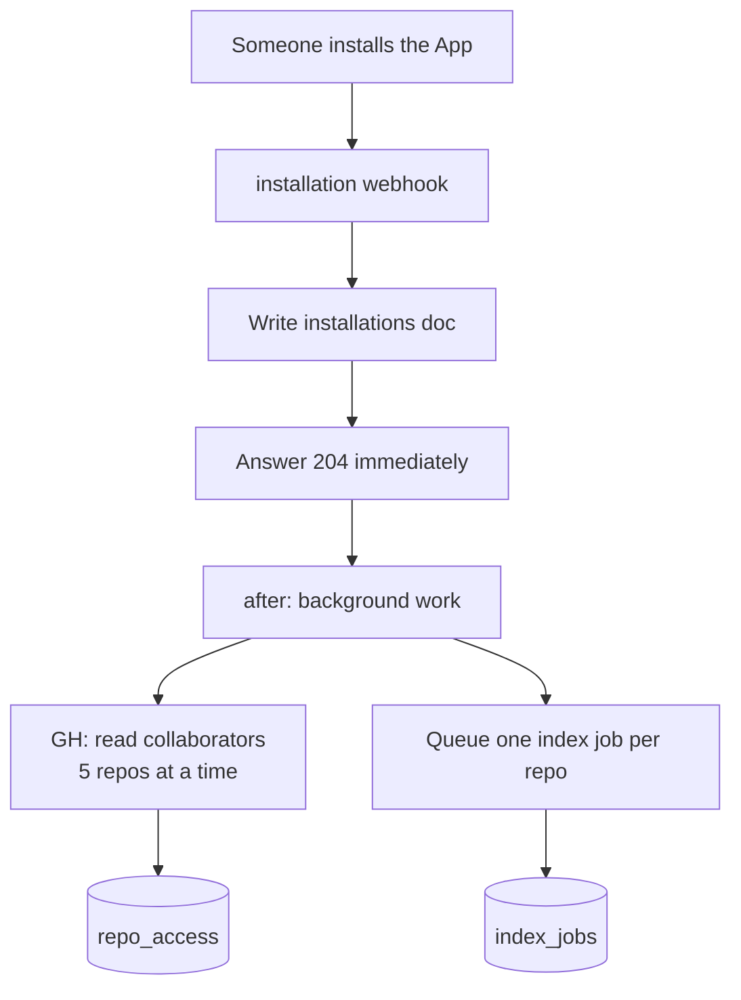
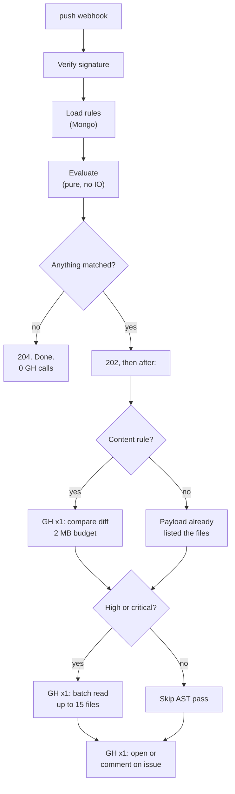
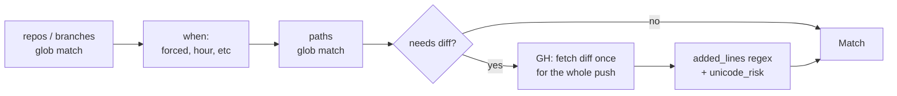
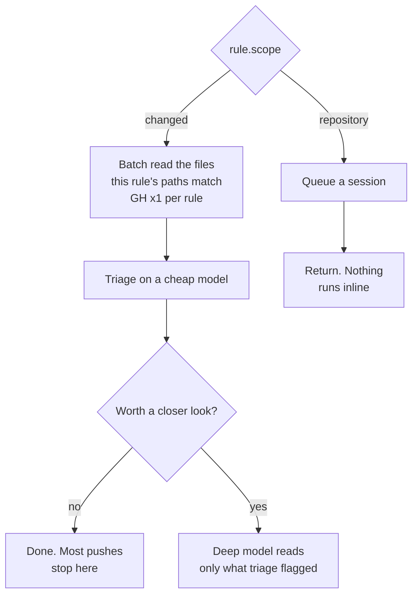
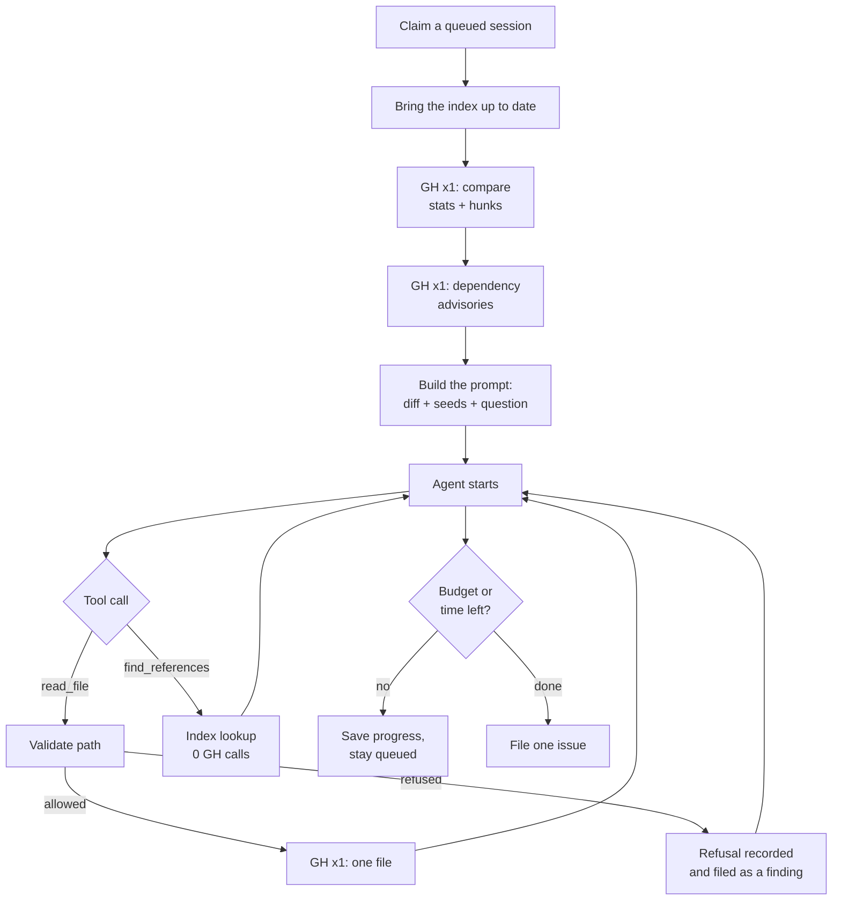
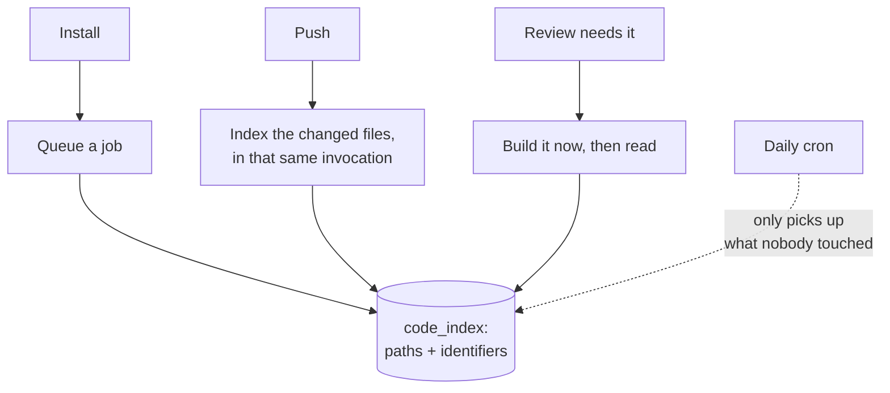
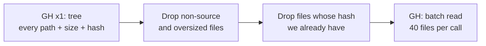
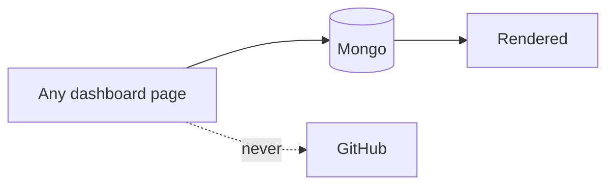
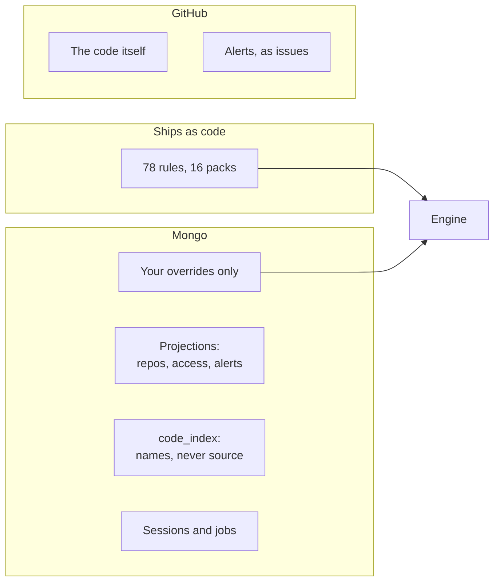

# How it actually runs

Every diagram below is one real path through the code. `GH` marks a GitHub API
call; everything unmarked is Mongo or pure computation.

## 1. Install

**No rules are written.** The 78-rule catalog ships as code, so detection is live
on the first push with zero database writes.

The webhook answers before doing any of this. A webhook that blocks on hundreds
of repositories gets retried by GitHub, which starts the work again.

## 2. A push

The common case is the important one: **a push that matches nothing costs zero
GitHub calls.**

Why the file read is gated twice: `ci-workflow-changed` fires whenever anyone
edits a workflow. Reading files on every one of those is most of a bill for
almost none of the signal.

### Reads per push

| Situation | GitHub calls |
|---|---|
| Nothing matched | **0** |
| Path rule matched | 1 (the issue) |
| Content rule matched | 2 (diff + issue) |
| High/critical, JS/TS present | 3 (diff + one batch + issue) |
| A rule asks `unreviewed` | +1, and only if that rule's repo and branch match |
| Force push | +1 (the erased side) |

## 3. Rules, in the order they run

Cheap and pure first. Nothing touches the network until a rule has already
matched on metadata.

The diff is fetched **once per push**, not once per rule, and lines are
normalised once for all rules rather than once per rule.

## 4. AI rules

Files another rule already pulled are reused, so ten rules aimed at the same
paths still cost one read per file.

## 5. A repository review session

Runs in the background, resumable, pinned to one commit.

Two rules per invocation, 45s budget. Whatever is unfinished stays queued at the
same commit and the next trigger picks it up.

## 6. The code index

This is what makes `find_references` cost nothing at review time.

**No source code is stored** — paths and identifiers only. A copy of this
database is not a copy of anybody's code.

### Why indexing is cheap

The tree carries file **sizes**, so a 5 MB bundle is skipped without ever being
downloaded. Hashes mean an unchanged file is never re-read.

**200 files = 6 calls** (1 tree + 5 batches), not 200.

## 7. What the dashboard costs

Zero GitHub calls. Repository lists, branches, teams, alert state and comments
are all projections kept current by webhooks.

One deliberate exception: **which repositories a user may read** is asked of
GitHub on every request, because no webhook reliably says when that changed.

## 8. Where data lives

Nothing is cached with a TTL. Projections are applied from webhook events —
GitHub says what changed, we write it. Not a copy with a guess about when it
went stale.

## Limits that bound a run

| | |
|---|---|
| Webhook payload | 1 MB |
| Diff read | 2 MB, and truncation is **reported as a finding** |
| AI rules per push | 10 |
| Files per AI rule | 10, 40k chars each, 120k total |
| Whole AI pass | 40s |
| One model review | 25s, 1 retry |
| Tool calls per repository rule | 5–120, default 40 |
| Model reviews per account per day | 200 |
| Scans | 25/day, 20 repos, 1 at a time |

Every one of these reports when it is hit. A limit that silences a detector
without saying so is a place to hide things.
